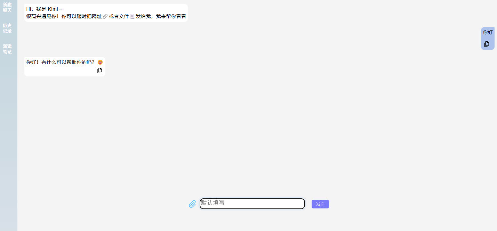
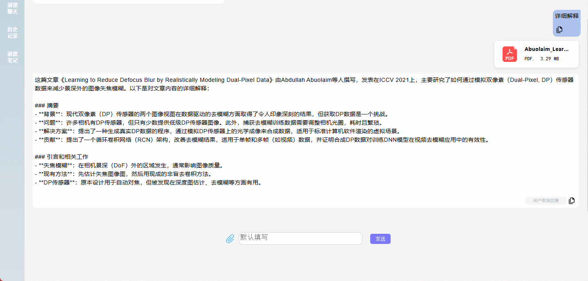

<div style="width:100%; display:flex; flex-direction:column; justify-content:center; align-items:center; font-size:30px; font-weight:700">
<div>Kimi Api</div>
<div style="font-size: 16px; font-weight:normal">The api of kimi llm model</div>
</div>

## How to use

```js
const kimiApi = new KimiApi({
    chatId: chatId,
    accessToken: accessToken,
    refreshToken: refreshToken,
})
```

*create UI*
```js
const kimiMainContainerDiv = kimiApi.kimiCreateMainUi({})
```
<div align="center">

</div>

*chat history*
```js
kimiApi.kimiInitChatHistory()
```
<div align="center">

</div>
